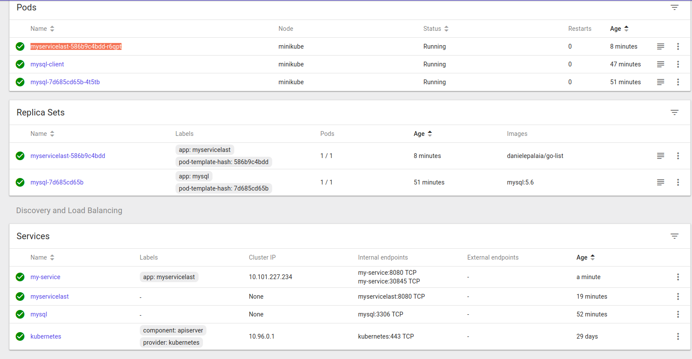

# Introduction

This application is continuing the experiment done here for Cloud Foundry:  
https://github.com/DanielePalaia/cf-mysql-example
But in this case we will depoy the application on Kubernetes using mini-kube   
The software is using the following technologies: Go, Mysql, Docker, and Kubernetes (minikube).  

The application is quite simple it's just exposing a set of rest api to manage a todo list   

## Testing the application locally:
One built you can try the application locally:  

you need to create a mysql database as specified in datastore.sql file 

After it you can use curl to test the app  
You can test with curl the various rest api, for instance  

curl http://localhost:8080/todos 

will perform a  get to the collection showing all the collection elements 

this one will create a new element to the collection 
curl -H "Content-Type: application/json" -d '{"Topic":"New TodoElem", "Completed":0}' -X POST http://localhost:8080/todos 

this one will get an element: 
curl http://localhost:8080/todos/1 

this one will update an existing element of the collection 
curl -H "Content-Type: application/json" -d '{"Id":0,"name":"New TodoElem Updated"}' -X PUT http://localhost:8080/todos 

this one will delete a resource 
curl -X DELETE http://localhost/todos/1 

this one will delete all the collection 
curl -X DELETE http://localhost/todos 

 
## Running the app on docker:
### Create a mysql docker like this:  
docker run -p 3306:3306 --name some-mysql -e MYSQL_ROOT_PASSWORD=my-secret-pw -d mysql/mysql-server:5.7  
### Create database and new user
Enter inside the docker created and create the datastore as done locally  
docker exec -it some-mysql mysql -uroot -p 
 
After this create a new use and grant privileges on the database just created  
GRANT ALL PRIVILEGES ON *.* TO 'daniele'@'%' IDENTIFIED BY 'daniele' WITH GRANT OPTION;  
Do now a docker inspect some-mysql and get the ip of the docker image 
### Configure input properties 
Now collect all this info (username, password and ip and put it in the program configuration file ./conf
### Run the software in a docker container and link to mysql
A dockerfile is provided 
sudo  docker build -t web-service-kubernetes . 
docker run --publish 6060:8080 --name test --link some-mysql:mysql --rm web-service-kubernetes  
This will now listen on port 6060 use curl as done before to test it... 

 
## Running on kubernetes (minikube): TODO

### Putting the docker image on dockerhub
I already created a dockerhub repository. In my case will be: 
docker push danielepalaia/go-list:tagname 

### Install minikube
Minikube allows you to have and manage a local kubernetes cluster  
Follow this guide to install minikube on ubuntu  
https://linuxhint.com/install-minikube-ubuntu/ 
 
Run minikube start and minikube dashboard to run the dashboard  
 

### Create a pod and a service for mysql
Follow this guide on how to create a mysql pod and service 
https://kubernetes.io/docs/tasks/run-application/run-single-instance-stateful-application/

 

### Create a deployment, pod and a service for the service docker image

yaml file are provided inside kubernetes-yaml

 

 
 
