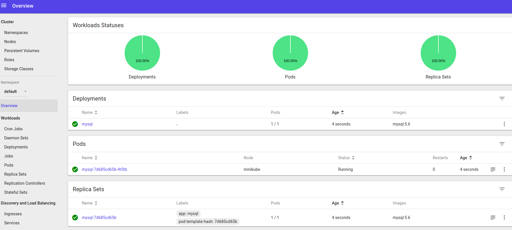
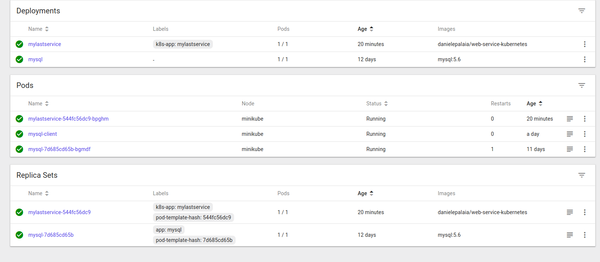

# Introduction

Scope of this software is just to play around with Kubernetes (Minikube). </br>
This software is exposing a set of rest-api to manage a collection of ToDo operations and is accessing mysql to store and read Todos. </br>
We will see how this app can be deployed locally, using just Docker containers to link one container to another or using kubernetes, minikube in this case. </br>
In the past I also used this app deployed on Pivotal CF: </br>
https://github.com/DanielePalaia/cf-mysql-example </br>

## Datastore and rest api

The todos operations are saved in a mysql datastore defined in datastore.sql

```
CREATE TABLE ToDo (
	    ID int NOT NULL AUTO_INCREMENT,
	    Topic varchar(255),
	    Completed int,
	    Due varchar(255) DEFAULT '',
	    PRIMARY KEY (ID)
);
```

The software exposes these rest api (GET, POST, PUT, DELETE) which can be tested with curl.</br>
Use GET to get all todo items inside the collection </br>
Use POST to create a new item for the Todo Collection </br>
Use PUT for update and DELETE for deletion </br>

```
curl http://localhost:8080/todos
curl -H "Content-Type: application/json" -d '{"Topic":"New TodoElem", "Completed":0}' -X POST http://localhost:8080/todos
curl http://localhost:8080/todos/1
curl -H "Content-Type: application/json" -d '{"Id":0,"name":"New TodoElem Updated"}' -X PUT http://localhost:8080/todos
curl -X DELETE http://localhost/todos/1
curl -X DELETE http://localhost/todos
```

## Testing the application locally
Once built you can try the application locally: </br>

you need to create a mysql database as specified in datastore.sql file</br>

Then you can simply run the binary web-service-kubernetes

After it you can use curl to test the app </br>
You can test with curl the various rest api described before</br>

 
## Running the app on docker containers only
### 1. Create a mysql docker like this: </br>
Docker file is already provided you can just: </br>
```
docker run -p 3306:3306 --name some-mysql -e MYSQL_ROOT_PASSWORD=my-secret-pw -d mysql/mysql-server:5.7
```
### 2. Create database and new user
Enter inside the docker created and create the datastore as done locally </br>
```
docker exec -it some-mysql mysql -uroot -p
```

After this create a new use and grant privileges on the database just created </br>
GRANT ALL PRIVILEGES ON *.* TO 'daniele'@'%' IDENTIFIED BY 'daniele' WITH GRANT OPTION;</br></br>
Do now a docker inspect some-mysql and get the ip of the docker image 
### 3. Configure input properties 
Now collect all this info (username, password and ip and put it in the program configuration file ./conf
### 4. Run the software in a docker container and link to mysql
A dockerfile is provided</br>

```
sudo  docker build -t web-service-kubernetes .
docker run --publish 6060:8080 --name test --link some-mysql:mysql --rm web-service-kubernetes
```

This will now listen on port 6060 use curl as done before to test it...</br>
### 5. Test the rest api as before

 
## Running on kubernetes (minikube)

### 1. Putting the docker image on dockerhub
I already created a dockerhub repository. In my case will be:</br>
https://cloud.docker.com/repository/registry-1.docker.io/danielepalaia/web-service-kubernetes
docker push danielepalaia/web-service-kubernetes</br>

### 2. Install minikube
Minikube allows you to have and manage a local kubernetes cluster </br>
Follow this guide to install minikube on ubuntu </br>
https://linuxhint.com/install-minikube-ubuntu/</br>
</br>
Run minikube start and minikube dashboard to run the dashboard </br>
 

### 3. Create a volume, a pod and a service for mysql
Follow this guide on how to create a mysql pod and service</br>
https://kubernetes.io/docs/tasks/run-application/run-single-instance-stateful-application/
Basically we need to create a Volume for mysql and a service for mysql. </br>
I put .yaml file in kubernetes-yaml folder. </br>
you can kubectl --apply to the volume first and then to the service </br>

```
kubectl apply -f ./mysql-pv.yaml
kubectl apply -f ./mysql-deployment.yaml
```

The first one will create a volume while the second one will create a deployment, a pod and a service for mysql.

### 4. Go inside mysql and create database and table as for datastore.sql
To do this you can create a mysql client to connect to the server </br>

```
kubectl run -it --rm --image=mysql:5.6 --restart=Never mysql-client -- mysql -h mysql -ppassword
```

This will prompt you inside the mysql server where you can create database and table.

 

### 5. Create a pod for this service web-service-kubernetes
I usually the minikube dashboard, you can go to new and specify as image danielepalaia/web-service-kubernetes



### 6. Forward the port from pod locally
Apparently minikube doesn't support services of type LoadBalancer... so we must just use one pod forwarding the port.
kubectl port-forward pod-name 8080:8080

### 7. You can then use the rest api as before from your localhost

## Useful kubernetes command

1) Getting the shell from a container </br>

kubectl exec -it my-pod -- /bin/bash </br>

with docker instead: 

docker ps to take the id of the container

</br>
docker exec -it docker-id bash
</br>

## Automation with Ansible
ToDo: start playing some automation with ansible...


 
 
